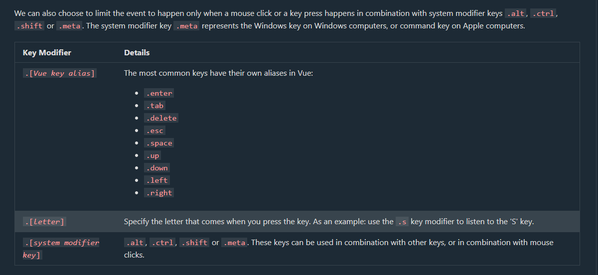

Event modifiers in Vue modify how events trigger the running of methods and help us handle events in a more efficient and straightforward way.

Event modifiers are used together with the Vue v-on directive, to for example:

    Prevent the default submit behavior of HTML forms `(v-on:submit.prevent)`
    Make sure that an event can only run once after the page is loaded `(v-on:click.once)`
    Specify what keyboard key to use as an event to run a method `(v-on:keyup.enter)`

We use event modifiers by first connecting a tag to an event like we have seen before:

``` html
<button v-on:click="createAlert">Create alert</button>
```

Now, to define more specifically that the button click event should only fire one time after the page loads, we can add the .once modifier, like this:

``` html
<button v-on:click.once="createAlert">Create alert</button>
```


Event Modifiers need a visit again as too much info. 